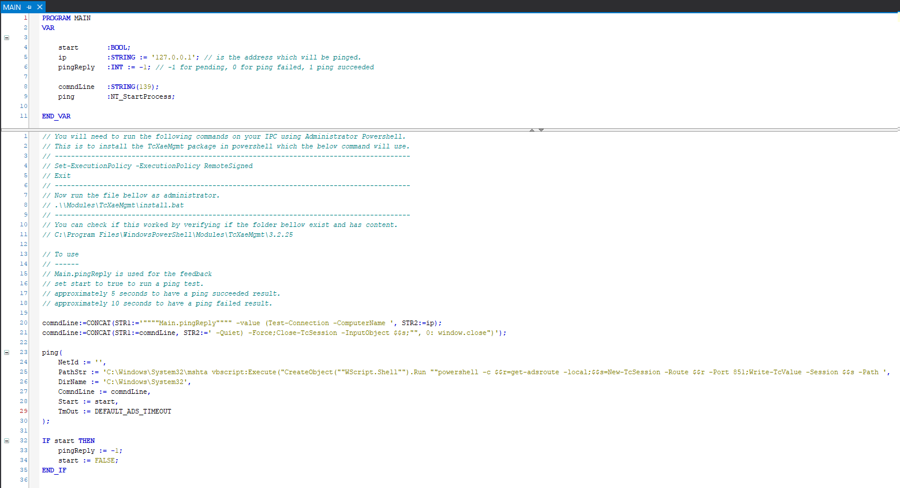

# Ping response using Tc3, NT_StartProcess and Powershell

## Disclaimer
This is a personal guide not a peer reviewed journal or a sponsored publication. We make
no representations as to accuracy, completeness, correctness, suitability, or validity of any
information and will not be liable for any errors, omissions, or delays in this information or any
losses injuries, or damages arising from its display or use. All information is provided on an as
is basis. It is the reader’s responsibility to verify their own facts.

The views and opinions expressed in this guide are those of the authors and do not
necessarily reflect the official policy or position of any other agency, organization, employer or
company. Assumptions made in the analysis are not reflective of the position of any entity
other than the author(s) and, since we are critically thinking human beings, these views are
always subject to change, revision, and rethinking at any time. Please do not hold us to them
in perpetuity.

## Overview 
This is a proof of concept that you can use NT_StartProcess (with powershell) to tell if a ping was successful.    

## Getting Started
You will need to install the TcXaeMgmt module in to Powershell on the target which this project will be run.

To do so (if you have no internet connection), open Powershell as administrator and execute this on cmd
```bash
Set-ExecutionPolicy -ExecutionPolicy RemoteSigned
```

Then go to folder .\src\Main\Modules\TcXaeMgmt and execute as administrator.

```bash
install.bat 
```

The folder ``` C:\Program Files\WindowsPowerShell\Modules\TcXaeMgmt\3.2.25 ``` should look like this:

## Screenshot


You can download the offline package by yourself at: https://www.powershellgallery.com/packages/TcXaeMgmt/3.2.25

You should set the return value to -1 then run the ping. Type 127.0.0.1 and force start to TRUE.

## Screenshot


## Code Snippets
We have 2 main limitations with NT_StartProcess.  The first is that we are unable to return values directly from the executed application.  Secondly we are limited to T_MaxString as input parameters (strings of 255 characters).  The input parameter size can be doubled by spreading both path and arguments across both PathStr and ComndLine parameters.  These are concat together which means you have 510 characters to play with.  

Building the layers of this example, we start with the program we will execute.  First, the ping code we will create in Powershell.
```powershell
$r = get-adsroute -local;
$s = New-TcSession -Route $r -Port 851;
Write-TcValue -Session $s -Path "Main.pingReply" -value (Test-Connection -ComputerName 127.0.0.1 -Quiet) -Force;
Close-TcSession -InputObject $s;
```
This finds the local ads router, creates a session on port 851.  Then writes the boolean response of Test-Connection to the variable "Main.pingReply" and closes the session.  You can verify this code works as expected by running it directly in powershell.  We capture this boolean in to an Integer so that we can preset it's value to -1.  If the variable stays at -1 then you know the code was not successfully executed. 

To execute this on cmd you can use 
```bash
powershell -c $r = get-adsroute -local;$s = New-TcSession -Route $r -Port 851;Write-TcValue -Session $s -Path "Main.pingReply" -value (Test-Connection -ComputerName 127.0.0.1 -Quiet) -Force;Close-TcSession -InputObject $s;
```

We could now execute this directly using NT_StartProcess but this would causes the powershell window to pop-up which is not ideal.  

In order to hid this we can use mshta to execute vbscript directly from the command line.

```
C:\Windows\System32\mshta vbscript:Execute(<<vb script goes here>>)
``` 

So combining the whole command together results in the following.
```bash
C:\Windows\System32\mshta vbscript:Execute("CreateObject(""WScript.Shell"").Run ""powershell -c $r=get-adsroute -local;$s=New-TcSession -Route $r -Port 851;Write-TcValue -Session $s -Path """"Main.pingReply"""" -value (Test-Connection -ComputerName 127.0.0.1 -Quiet) -Force;Close-TcSession -InputObject $s;"", 0: window.close")
```

The final step was to escape the $ using $$ in TwinCAT and to split the string across the two parameters. 

## Versions
* TcXaeShell 3.1.4024.20
* TcXaeMgmt 3.2.25 for Powershell (instructions included in Main.POU)

## Need more help?
Please visit http://beckhoff.com/ for further guides
